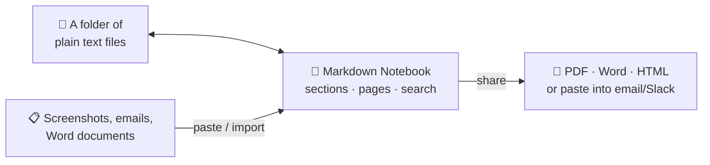

# Markdown Notebook

**A friendly desktop notebook for your work notes — that never takes your notes hostage.**

By Stephen Rector.

Markdown Notebook turns any folder on your computer into a proper notebook: sections and pages, daily notes, to-do tracking, diagrams, and polished PDF exports. Behind the scenes your notes are ordinary text files the whole time — they sync with anything (iCloud, OneDrive, git), open in any editor, and if you ever stop using the app, you lose nothing.



## Everything in one place

- **Sections and pages.** Folders are sections, files are pages. Drag pages between sections, pin the important ones, and reorder things however you like.
- **Daily notes.** Name a page with a date (`2026-07-13`) and it gets a calendar icon and sorts newest-first — a running work journal with zero setup.
- **Tabs.** Keep several notes open at once, just like a browser, with a dot marking anything unsaved.
- **Write your way.** A distraction-free reading view, a plain editor, or both side by side. Checkboxes in the reading view are clickable — tick off tasks without switching modes.
- **To-dos that follow you.** Every `- [ ]` you jot down is counted in the sidebar and gathered on the section overview pages, so open tasks never hide in old notes.
- **Templates.** Meeting notes, weekly reviews, project kickoffs — make a template once and new pages fill in the date, title, and your name automatically.

## Find anything fast

- **One search box, three answers.** Type in the sidebar and results come back grouped: pages whose *title* matches, pages whose *content* matches (with the matching line shown and highlighted), and matching *tags*.
- **Tags with autocomplete.** Type `#` in the search box and every tag you've ever used pops up — keep typing to narrow the list, click one to filter the whole notebook.
- **Jump anywhere.** One shortcut (⌘K / Ctrl+K) opens a command palette that starts with your recently opened notes and finds any page or action as you type.
- **Connected notes.** Link between pages with `[[double brackets]]`; every note shows what links back to it.

## Diagrams and tables without the fiddly syntax

- **Diagram Builder.** Flowcharts, timelines, org-style charts, Gantt schedules, mind maps and more — filled in through a simple form with a live preview. No diagram syntax to learn, and an Edit button on any existing diagram reopens it in the builder.
- **Table editor.** Build and edit tables in a visual grid instead of counting pipe characters.
- **Paste screenshots.** Paste an image straight into a note and it's saved and linked for you. Dragging in files works too.

## Share your notes the way people want them

- **PDF** — one note, a whole section, or the entire notebook as a single PDF with a generated table of contents. Pick light, dark, or minimal styling and the diagrams re-color themselves to match.
- **Word** — export a note as `.docx` for the people who live in Office.
- **HTML** — a single self-contained file (images included) you can email or drop on a shared drive.
- **Copy as rich text** — paste a fully formatted note directly into an email, Slack, or a wiki.
- **Import, too.** Paste a copied email or web page as a clean new note, or import Word / PowerPoint / Excel files into the section of your choice.

## Little comforts

- **Spell check.** Misspelled words get the familiar red underline; right-click one for suggested corrections or to add it to your dictionary.
- **Quick capture.** A system-wide shortcut (⌘⇧N / Ctrl+Shift+N) pops up a small note-jotting window from anywhere — even when the app is in the background — and files what you type into today's daily note.
- **Six looks.** Light, Dark, Midnight, Forest, Sepia, or follow your system.
- **A safety net.** Deleted notes go to a built-in trash you can restore from, and the app quietly keeps earlier versions of each note so you can bring back last Tuesday's wording.
- **Keyboard friendly.** Shortcuts adapt to Mac and Windows conventions, and a shortcut reference lives right in the app.

## Getting it

Grab the latest release for your platform from the **Releases** page:

- **Windows installer** — installs just for you; it never asks for an administrator password.
- **Windows portable** — a single `.exe` that runs from anywhere (Downloads folder, USB stick, a locked-down work machine) with nothing to install. Its settings live in a folder right next to it, so it travels well.
- **macOS** — a standard drag-and-drop disk image.

First launch: pick (or create) a folder to be your notebook, and start writing.

The only optional extra is [Pandoc](https://pandoc.org/installing.html), needed just for Word/PowerPoint/Excel import and Word export — everything else works out of the box, entirely offline.

## Your files stay yours

Every note is a plain `.md` text file in a folder you chose. The app adds only small housekeeping files (page ordering, trash, version history) inside that folder, all plain text and safe to commit to git. There's no account, no cloud, and no database — which also means any sync tool you already use just works.

The app also keeps one tiny reminder file in your home folder (`.markdown-notebook/last-notebook.json`) recording where your notebook lives — so even a fresh copy of the portable version reopens the right notebook. If it can't find your notebook anywhere, it simply asks again.

## Building from source

```bash
npm install
npm start          # compile and run the app
npm run pack       # build installers/portable for your platform (dist/)
```

See `docs/RELEASING.md` for the full release and code-signing setup, and `docs/team-reports/` for the development history.

## License

MIT
