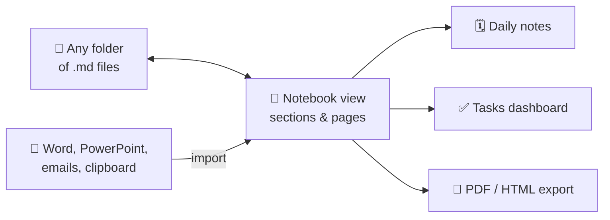
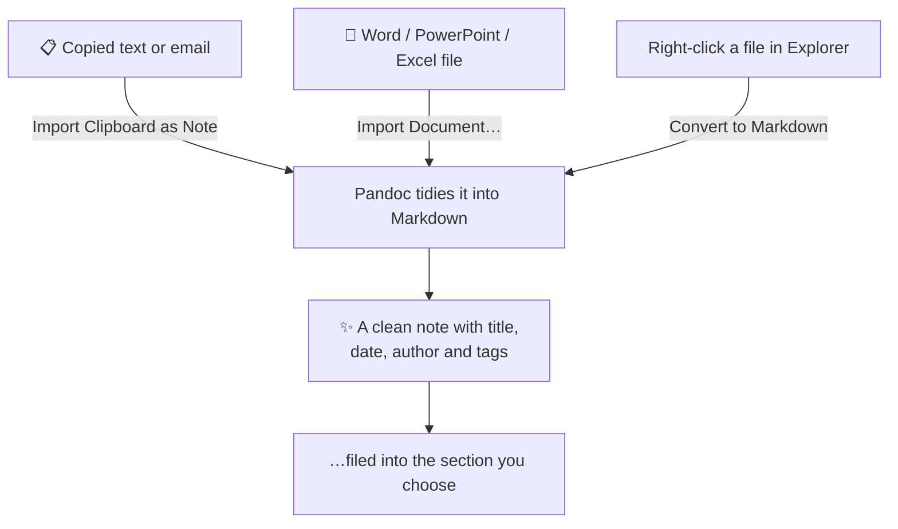
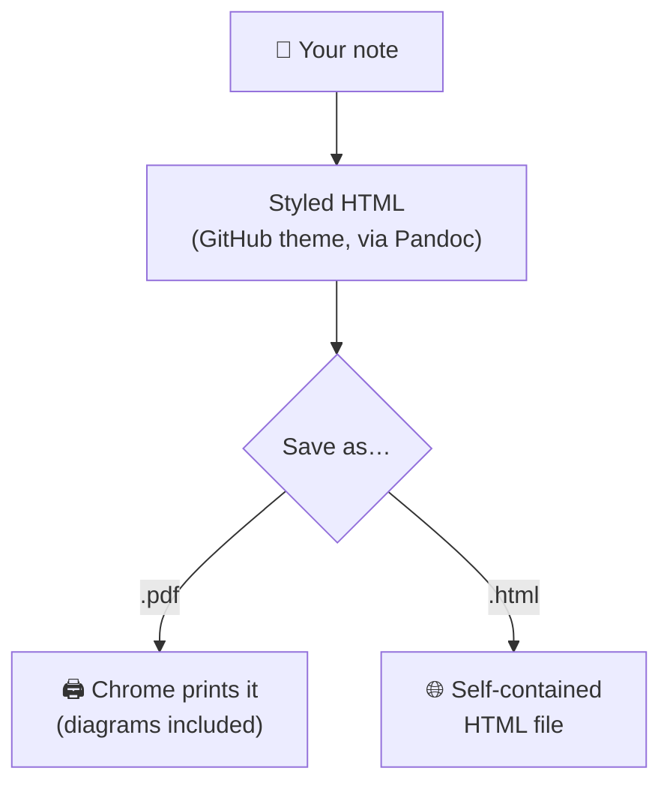

# Markdown Notebook

**A OneNote-style notebook for VS Code — built on plain Markdown files.**

By Stephen Rector.

Markdown Notebook turns any folder into a friendly notebook: sections, pages, templates, daily notes, task tracking, and one-click import of Word documents or copied emails. Your notes are ordinary `.md` files on disk the whole time, so they work with git, sync tools, and GitHub Copilot — and you can stop using the extension any time without losing a thing.



## Getting started

1. Install the extension.
2. Open a folder (or create an empty one) — this becomes your notebook.
3. Click the **Notebook** icon in the activity bar (left edge of VS Code).
4. Press the **+** button to create your first page or section.

That's it for note-taking. For importing documents and exporting PDFs, install [Pandoc](https://pandoc.org/installing.html) (see [What you need](#what-you-need) below).

## The Notebook view

The Notebook sidebar shows your folder the way a notebook should look:

- **Folders are sections**, with a page count. **`.md` files are pages.**
- Page names come from the note's title, not its filename.
- 📌 Notes with `pinned: true` in their header float to the top with a star.
- 🗓️ Date-named notes (like `2026-06-10.md`) get a calendar icon, friendly labels ("today", "yesterday"), and sort newest-first.
- Each page shows its modified date, the first few `#tags`, and how many open `- [ ]` tasks it has.
- Housekeeping folders (`.git`, `templates`, `attachments`, …) are hidden automatically.

Right-click anything for actions: new page, rename, move up/down, export to PDF, delete. You can also **drag and drop** pages between sections.

### Tables of contents — automatic

Every section gets a hidden table-of-contents page, kept up to date for you. It lists the section's pages, shows task-completion stats, and each note gets a small "← back to TOC" link at the top. Click a section in the sidebar to see its TOC. There's also a notebook-wide dashboard and a **Tasks Dashboard** (checklist icon in the toolbar) that gathers every open task across all your notes.

### Daily notes

Click the calendar icon (or run **Notebook: New Daily Note**) to open today's note — it's created in a `Daily` section if it doesn't exist yet. If you have a template named `daily.md`, it's used automatically.

### Templates

**New from Template** creates a page from any `.md` file in your `templates/` folder. Templates can include placeholders that are filled in when the page is created:

`{{title}}`, `{{date}}`, `{{time}}`, `{{datetime}}`, `{{year}}`, `{{month}}`, `{{day}}`, `{{weekday}}`, `{{slug}}`, and `{{cursor}}` (where your cursor should land).

No templates yet? The command offers to create starter `daily` and `meeting` templates for you.

### Renaming without breaking links

**Rename (update links)** — the pencil icon on a page — renames a note *and* updates every `[[wiki-link]]` to it across your notebook, including links with aliases (`[[note|shown text]]`) and section links (`[[note#Heading]]`). Changes to other notes are left as unsaved edits so you can review them before saving. If two notes share the same file name, ambiguous links are left untouched rather than guessed at.

## Importing — get things *into* your notebook



Three ways in:

- **Import Clipboard as Note** (clipboard icon): copy anything — an email chain, a web page section, plain text — and it becomes a clean Markdown note. Rich text keeps its links, quoting, and tables. You pick the title and where it goes.
- **Import Document…** (download icon): pick a Word, PowerPoint, Excel, or other document from anywhere on your computer; it's converted and filed into the section you choose. The original file is never touched.
- **Right-click a file in the Explorer → Convert to Markdown (Pandoc)**: converts a document that's already in your folder. By default the original is moved to the OS Trash afterwards (recoverable — and you can turn this off).

Converted notes get a proper title (taken from the document's first heading), creation date, your author name, and a `converted` or `imported` tag — so they show up in the Notebook view looking like they belong.

| You can import | Notes |
|----------------|-------|
| `.docx` Word | Embedded images are extracted alongside the note |
| `.pptx` PowerPoint | Needs Pandoc 3.8.3 or newer |
| `.xlsx` Excel | Needs Pandoc 3.8.3 or newer — each worksheet becomes a table |
| `.odt`, `.rtf`, `.epub`, `.html` | Also supported |

> Old-style `.doc` / `.ppt` / `.xls` files aren't supported — re-save them in Office as the modern `x` format first.

## Writing and formatting

A **Markdown Format** menu lives in the editor title bar (and the right-click menu) for common formatting, or use the shortcuts:

| Shortcut (Windows/Linux · Mac) | Does |
|-------------------------------|------|
| `Alt+Shift+M` · `Cmd+Alt+M` | Open the format picker |
| `Ctrl+Shift+B` · `Cmd+Shift+B` | **Bold** |
| `Ctrl+Shift+I` · `Cmd+Shift+I` | *Italic* |
| `Ctrl+Alt+1/2/3` · `Cmd+Alt+1/2/3` | Heading 1 / 2 / 3 |
| `Ctrl+Alt+B` · `Cmd+Alt+B` | Bulleted list |
| `Ctrl+Alt+N` · `Cmd+Alt+N` | Numbered list |
| `Ctrl+Alt+X` · `Cmd+Alt+X` | Task list item |
| `Ctrl+Alt+C` · `Cmd+Alt+C` | Check / uncheck a task |
| `Ctrl+Alt+-` · `Cmd+Alt+-` | Horizontal separator |
| `Alt+Shift+S` · `Cmd+Alt+S` | Jump from preview to the Markdown source |

## A better preview

The extension upgrades VS Code's built-in Markdown preview (`Ctrl+K V`) — nothing new to learn:

- **GitHub styling** that follows your light/dark mode, with **Standard / Wide / Full** width buttons right in the preview.
- **Mermaid diagrams**: fence a block with ` ```mermaid ` and it renders as a diagram (like the ones in this README), themed to match your editor and with zoom controls. Works offline.
- **Task checkboxes** you can see at a glance, and `==highlighted text==` support.
- Prefer the plain VS Code preview? Set `markdownNotebook.previewTheme` to `off`. Want dark always? Set it to `github-dark`.
- Want notes to *open* in the pretty preview by default? Turn on `markdownNotebook.alwaysShowPreview`.

An **Outline** panel below the Notebook view tracks the headings of whatever note you're reading and follows along as you scroll.

## Export to PDF (or HTML)

Right-click any note — in the Notebook view, the Explorer, or an editor tab — and choose **Export to PDF…**.



- **PDF**: by default a headless Chrome does the printing, so the result looks exactly like the preview — Mermaid diagrams included. If you don't have Chrome installed, the extension offers a one-time download (~150 MB) of a private copy just for exports.
- **Prefer no browser?** Set `markdownNotebook.pdfEngine` to `auto` to use a lightweight engine instead (it finds WeasyPrint, wkhtmltopdf, or Prince — install one with e.g. `pip install weasyprint`). With these engines, install [mermaid-cli](https://github.com/mermaid-js/mermaid-cli) (`npm i -g @mermaid-js/mermaid-cli`) if you want diagrams rendered in the PDF.
- **HTML**: choose a `.html` filename in the save dialog instead and you get a single, styled, share-anywhere HTML file.

Exports use a clean light GitHub theme by default — good for printing. Change it with `markdownNotebook.exportTheme`.

## What you need

| For… | You need | Notes |
|------|----------|-------|
| Notes, sections, templates, daily notes, tasks, preview | **Nothing extra** | Works out of the box |
| Importing / converting documents | [Pandoc](https://pandoc.org/installing.html) | macOS: `brew install pandoc` · Windows: `winget install --id JohnMacFarlane.Pandoc` · Linux: `sudo apt install pandoc` |
| PowerPoint / Excel import | Pandoc **3.8.3+** | Linux distro packages are often older — grab the [latest release](https://github.com/jgm/pandoc/releases) |
| PDF export | Pandoc + Chrome | Chrome/Chromium is found automatically, or downloaded once with your permission |

## Settings worth knowing

Open them with the gear icon on the Notebook view. The most useful ones:

| Setting | Default | What it does |
|---------|---------|--------------|
| `markdownNotebook.root` | *(first open folder)* | Use a subfolder (e.g. `notes`) as the notebook instead |
| `markdownNotebook.author` | *(empty)* | Your name, written into new notes' headers |
| `markdownNotebook.alwaysShowPreview` | `false` | Open notes in the rendered preview instead of the editor |
| `markdownNotebook.previewTheme` | `github` | Preview styling: `github`, `github-dark`, or `off` |
| `markdownNotebook.defaultPageWidth` | `standard` | Preview page width: `standard`, `wide`, or `full` |
| `markdownNotebook.pdfEngine` | `chrome` | PDF export engine: `chrome`, `auto`, or a specific lightweight engine |
| `markdownNotebook.exportTheme` | `github` | Styling for PDF/HTML exports |
| `markdownNotebook.dailyNotePattern` | `YYYY-MM-DD` & friends | Which filenames count as daily notes |
| `markdownNotebook.templatesFolder` | `templates` | Where your page templates live |
| `pandocToMarkdown.deleteOriginal` | `true` | Remove the original after converting (to Trash by default) |
| `pandocToMarkdown.useTrash` | `true` | Trash (recoverable) vs. permanent delete |

## Good to know

- **Your files stay yours.** Everything is plain Markdown; the only extras the extension writes are hidden index files (`.toc.md`, `.tasks.md`, `.notebook-order`) that keep the tables of contents, task dashboard, and your manual page ordering. They're regular text files and safe to commit to git.
- **Originals are only removed after a conversion succeeds**, and go to the OS Trash by default.
- File names with spaces or special characters are handled safely — files are passed to Pandoc directly, never through a shell.

## Building from source

```bash
npm install
npm run compile   # or: npm run watch
```

Open the folder in VS Code and press `F5` to try it in an Extension Development Host, or package and install it:

```bash
npm install -g @vscode/vsce
vsce package
code --install-extension markdown-notebook-*.vsix
```

## License

MIT
